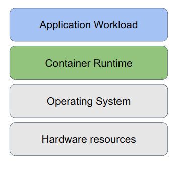
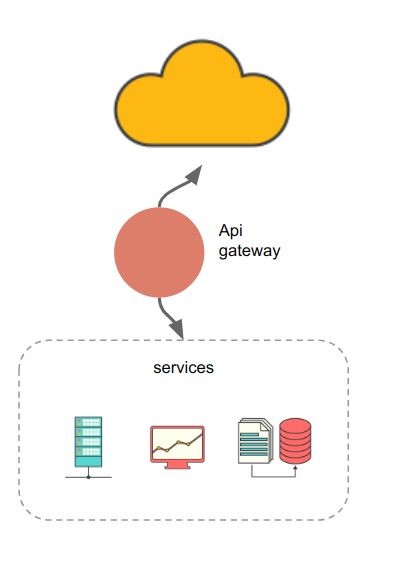
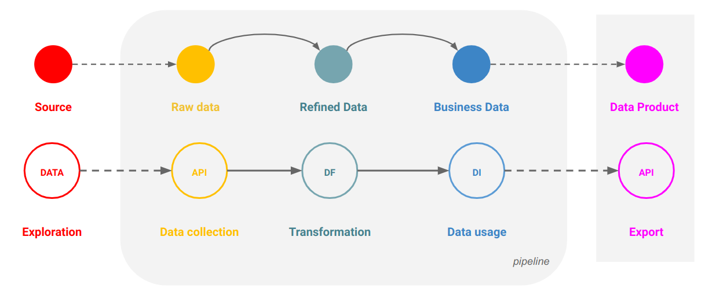
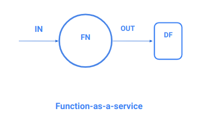

# Overview and architecture

The DigitalHub platform offers a flexible, fully integrated environment for the development and deployment of full-scale data- and ML- solutions, with unified management and security.

The platform at its core is composed by:

* The base infrastructure, which offers flexible compute (w/GPU) and storage
* Dynamic workspaces (w/Jupyter/VSCode/Spark) for interactive computing
* Workflow and Job services for batch processing
* Data services to easily define ETL ops and expose data products
* ML services to train, deploy and monitor ML models

Everything is accessible and usable within a single project.

## Architecture and design

The platform adopts a layered design, where every layer adds functionalities and value on top of the lower layers. From top to bottom:

* *ML Engineering* is dedicated to MLOps and the definition, training and usage of ML products
* *Data Engineering* is devoted to DataOps, with full support for ETL, storage, schemas, transactions and full data management, with advanced capabilities for profiling, lineage, validation and versioning of datasets
* *Execution infrastructure* serves as the base layer

### Design principles

The platform is designed from ground up following modern architectural and operational patterns, to promote consistency, efficiency and quality while preserving the speed and agility required during initial development stages.

The principles adopted during the design can be grouped under the following categories.

#### GitOps

* Everything is code: functions,  operations, configurations
* Code is versioned!
* Declarative state for deployments, services

#### DataOps

* Datasets are immutable
* Datasets are versioned
* Use schemas
* Idempotent transformations only

#### MLOps

* Automate processes
* Track experiments
* Ensure reproducibility

#### Extensibility

* Native support for the integration of new functionality
* Standard infrastructures and frameworks
* Common workflow and abstractions

#### Resource optimization

* Reduce footprint
* Optimize interactive usage
* Maximize resource utilization

## Infrastructure layer

The infrastructure layer is the foundation of the platform, and offers a dynamic environment to run cpu (and GPU) workloads both as interactive and as scheduled jobs.

Based on Kubernetes, the platform supports distributed computing, scheduling, dynamic scaling, monitoring and operation automation for every tool and component of the platform.

Infrastructural components are the building blocks for the construction of workspaces used to develop, build and deploy complex solutions.

### Infrastructure: Compute

Managing compute resources is the core task for the infrastructure layer.

The DigitalHub adopts Kubernetes as the orchestration system for managing containerized applications: every workload is packaged into a container and executed in one or more pods, taking into account resource requests and constraints.

Developers can access and leverage hardware resources (e.g. GPU) by declaring the requirement for their workloads, both for interactive and batch computing.

### Infrastructure: Data stores

Data is the foundation of ML systems, and a key aspect of every analytical process.

The platform adopts an unified approach, and integrates:

* a **data lake-house** (*Minio*) as persistence store, for immutable data, both structured and unstructured, with high performance and scalability

* a **database** (*PostgreSQL*) as operational store, for high velocity and mutable data, with ACID transactions, geo-spatial and time-series extensions and horizontal scalability

### Infrastructure: Workspaces

Workspaces serve as the interactive computing platform for Data- and ML-Ops, executed in the cloud infrastructure.
By adopting a workspace manager (Coder), users are able to autonomously create, operate and manage dynamic workspaces based on templates, delivering:

* pre-configured working environments
* customizability
* resource usage optimization
* cost-effectiveness

### Infrastructure: Api gateway

Data- and ML-services are defined and deployed within the perimeter of a given project, and by default are accessible only from the inside.

{: style="max-height:350px;"}

An Api Gateway lets users expose them to the outside world, via a simplified interface aimed at:

* minimizing the complexity of exposing services on the internet
* enforcing a minimal level of security
* automating routing and proxying of HTTP requests

For complex use cases, a fully fledged api gateway should be used (outside the platform)

## Data engineering

Data engineering is the core layer for the base platform, and covers all the operational aspects of data management, processing and delivery.

By integrating modern ETL/ELT pipelines with serverless processing, on top of modern data stores, the DigitalHub delivers a flexible, adaptable and predictable platform for the construction of data products.

The diagram represents the data products life-cycle within the DigitalHub.

### DataOps: Unified data

Both structured and unstructured datasets are first-class citizens in the DigitalHub: every data item persisted in the data stores  is registered in the catalogue and is fully addressable, with a unique, global identifier.

The platform supports versioning and ACID transactions on datasets, regardlessly of the backing storage.

### DataOps: Query access

The platform adopts Dremio as the (SQL) query engine, offering a unified interface to access structured and semi-structured data stored both in the data lake and the operational database.
Dremio is a self-serve platform with web IDE, authentication and authorization, able to deliver data discoverability and dataset lineage.
Also with native integration with external tools via ODBC, JDBC, Arrow Flight

### DataOps: Interactive workspaces

Every data engineering process starts from data exploration, a task executed interactively by connecting to data sources and performing exploratory analysis.

The platform supports dynamic workspaces based on:

* **JupyterLab**, for notebook based analysis
* **SQLPad**, for SQL based data access
* **Dremio**, for unified data access and analysis
* **VSCode**, for a developer-centric, code-based approach

### DataOps: Serverless computing

Modern serverless platforms enable developers to fully focus on writing business code, by implementing functions which will eventually be executed by the compute layer.

There is no need for “executable” code: the framework will provide the engine which will transform bare functions into applications.

The platform adopts Nuclio as the serverless platform, and supports Python, Java and Go as programming languages.

### DataOps: Batch jobs and workflows

By registering functions as jobs we can easily execute them programmatically, based on triggers, or as batch operations dispatched to Kubernetes.

We can thus define workflows as pipelines composing functions, by connecting inputs and outputs in a DAG:

* Promote re-use of functions
* Promote composition
* Promote reproducibility
* Reduce platform- specific expertise at minimum

### DataOps: Data services

Datasets can be used to expose services which deliver value to consumers, such as:

* REST APIs for integration
* GraphQL APIs for frontend consumption
* User consoles for analytics
* Dashboards for data visualization
* Reports for evaluation

The platform integrates dedicated, pre-configured tools for the most common use cases, as zero-configuration, one-click deployable services.

### DataOps: Data products

A data product is an autonomous component that contains all data, code, and interfaces to serve the consumer needs.

The platform aims at supporting the whole lifecycle of data products, by:

* letting developers define ETL processes to acquire and manage data
* offering stores to track and memorize datasets
* exposing services to publish data for consumption
* fully describing data products in metadata files, with versioning and tracking

## ML engineering

Adopting MLOps means embracing the complete lifecycle of ML models, from data preparation and training to experiments tracking and model serving.

The platform integrates a suite of tools aimed at covering the full span of operations, enabling ML engineers to not only train and deploy models, but also manage complex pipelines, operations and services.

### MLOps: Interactive workspaces

The job of a ML engineer is mostly carried out inside an interactive compute environment, where the user performs all the operations related to data preparation, feature extraction, model training and evaluation.
The platform adopts JupyterLab, along with ML a range of frameworks, as interactive compute environment, delivering a pre-configured, fully adaptable workspace for ML tasks.

### MLOps: Data and features

Datasets are usually pre-processed by domain experts to define and extract features.

By adopting a full-fledged feature store (via MLRun), the platform lets developers:

* easily define features during training
* re-use them during serving
* ensuring that the very same features are used during the whole ML life-cycle

### MLOps: Model training and AutoML

Model training is a complex task, which requires deep knowledge of the ML model, the underlying library and the execution environment.

By integrating the most used ML frameworks, the platform lets developers focus on the actual training, with little to no effort dedicated towards:

* tracking experiments and runs
* collecting and evaluating metrics
* performing hyperparameter optimization (with distributed GridSearch)

With AutoML, supported models are automatically trained and optimized based on data and features, and eventually deployed as services in a fully automated way.

### MLOps: ML services

Fine-tuned ML models are used to provide services for external applications, by exposing a dedicated API interface.

The platform supports a unified Model Server, which can expose any model built upon a supported framework with a common interface, with optional:

* multi-step computation
* model composition
* feature access
* performance tracking
* drift tracking and analysis
