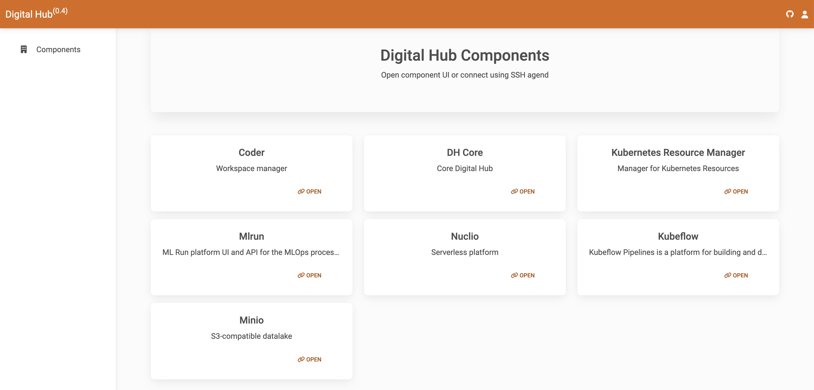

# Dashboard

The dashboard is a central access point to reach a number of tools that are automatically run when the platform is installed. There are two types of tools: components and monitoring.

**Components**

- *MLRun*, a framework for MLOps
- *MinIO*, an S3-compatible object datalake
- *Nuclio*, a platform for serverless functions
- *Kubeflow*, a tool for ML workflows on Kubernetes

**Monitoring**

TODO - Monitoring features are work-in-progress.

- *K8S Infrastructure*: deployed components and services
- *Resources*: CPU, traffic, memory usage...
- *Application logs*: Log data of components and services

!!! info "How to access"

    Access your instance of Coder and, under the *Workspaces* tab, you should see *digitalhub-dashboard* already listed. Click on it and you will see its logs and, above them, a number of buttons. Click on *dashboard*.
    
    If *digital-dashboard* isn't already there, you can create it by navigating to *Templates* and clicking *Use template* to the right of the *dashboard* entry.