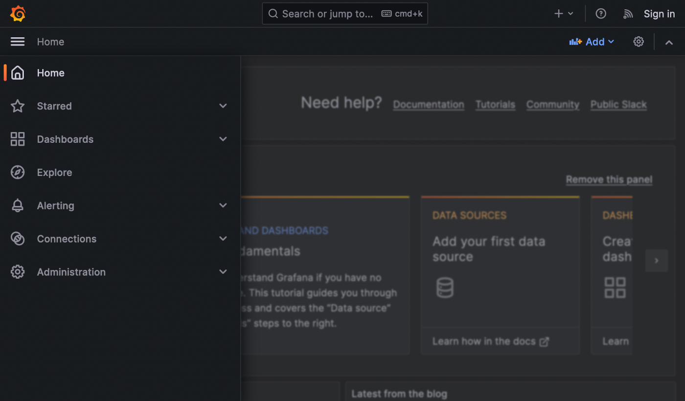
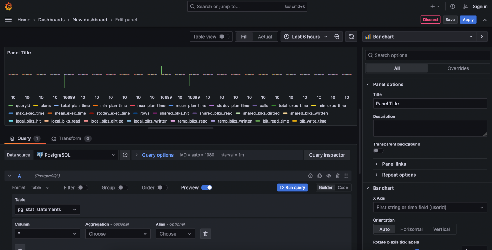

# Grafana

[Grafana](https://grafana.com/) is a platform for data monitoring and analytics, with support for common relational and time-series databases. It can also connect to Dremio, thanks to a plug-in developed by the Co-Innovation Lab.

- Support for Postgres, MySQL, Prometheus, MongoDB, etc.
- Visualize metrics, graphs, logs
- Create and customize dashboards

!!! info "How to access"

    Grafana may be launched from [Coder, using its template](/docs/components/deploying-components).
    After launching it from Coder you can access Grafana on [Grafana UI](http://nodeipaddress:30110).

## Add a data source

Extend the sidebar by clicking on the three-lines icon in the upper left.

Click *Administration* at the bottom. Click *Data sources* and then *Add new data source*.

!!! note "Adding data sources"

    You may also add data sources from the *Connections* menu.

A list of supported data sources will appear.

### Postgres

Many settings can be changed on the Postgres data source, but let's focus on the ones under *PostgreSQL Connection*, which you must fill to reach the database.

Since Grafana relies on time-series information to provide its monitoring features, ideally you want to create a new database, with tables with this functionality. However, if you just wish to test the tool, you can connect to the database that is created by default.

You can recover these values by launching a *SQLPad* workspace, accessing its *Terminal* (from the bottom above the logs in Coder) and typing `env`, which will list all the names and values of the environment variables of the tool.

- `Host`: value of `SQLPAD_CONNECTIONS__pg__host`
- `Database`: value of `SQLPAD_CONNECTIONS__pg__name` (should be `mlrun`)
- `User`: value of `SQLPAD_CONNECTIONS__pg__username` (should be `mlrun`)
- `Password`: value of `SQLPAD_CONNECTIONS__pg__password`

Once you have set these parameters, click *Save & test* at the bottom, and a green notification confirming database connection was successful should appear. You can click on *Explore view* to try running some SQL queries on the available tables.

### Dremio

!!! note "Dremio workspace"

    You need a Dremio workspace in order to add it as a data source in Grafana. You can create one from Coder.

Aside from a `Name` for the data source, it will ask for the following fields:

- `URL`: you can find this in Coder: go to your Dremio workspace and look for an *Entrypoint* value (next to *kubernetes_service*), which you can click to copy. It may look similar to: `http://dremio-digitalhub-dremio:9047`.
- `User`: `admin`
- `Password`: whichever *Dremio Admin Password* you entered when you created the Dremio workspace 

## Add a dashboard

Extend the sidebar by clicking on the three-lines icon in the upper left, click *Dashboard* and then *New > New dashboard*.

Let's add a simple panel. Click *Add visualization* and select one of the data sources you added, for example *PostgreSQL*. Grafana will automatically add a new panel to this new dashboard and open the *Edit panel* view for it.

On the bottom left, you can enter a query for a table in the database. Once you do that and click *Run query* in the same section, the message *Data is missing a time field* will likely appear. This is because the table you chose does not have a field for time-series and, by default, new panels are assumed to be for *Time series*.

If you simply click on the *Switch to table* button that appears, you will see the query's results. More interestingly, if you click *Open visualization suggesions*, or extend the visualization selection (in the upper right, where it says *Time series* or *Table*, depending on whether you clicked *Switch to table* or not), you will be able to explore a variety visualization options for your query.

## Resources

- [Official documentation](https://grafana.com/docs/grafana/latest/?plcmt=footer)