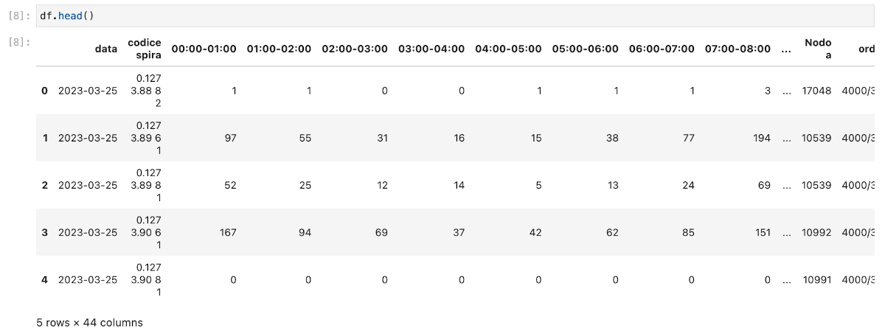

# ETL scenario introduction

Here we explore a simple yet realistic scenario. We collect some data regarding traffic, analyze and transform it, then expose the resulting dataset.

Access Jupyter from your Coder instance and create a new notebook. If a Jupyter workspace isn't already available, create one from its template.

We'll now start writing code. Copy the snippets of code from here and paste them in your notebook, then execute them with *Shift+Enter*. After running, Jupyter will create a new code cell.

The notebook file covering this scenario, as well as files for individual functions, are available in the `documentation/examples/etl` path within the repository of this documentation.

## Set-up

First, we initialize our environment and create a project.

Import required libraries:

``` python
import digitalhub as dh
import pandas as pd
import requests
import os
```

Create a project:

``` python
PROJECT = "demo-etl"
project = dh.get_or_create_project(PROJECT)
```

Check that the project has been created successfully:

``` python
print(project)
```

## Peek at the data

Let's take a look at the data we will work with, which is available in CSV (Comma-Separated Values) format at a remote API.

Set the URL to the data and the file name:

``` python
URL = "https://opendata.comune.bologna.it/api/explore/v2.1/catalog/datasets/rilevazione-flusso-veicoli-tramite-spire-anno-2023/exports/csv?lang=it&timezone=Europe%2FRome&use_labels=true&delimiter=%3B"
filename = "rilevazione-flusso-veicoli-tramite-spire-anno-2023.csv"
```

Download the file and save it locally:

``` python
with requests.get(URL) as r:
    with open(filename, "wb") as f:
        f.write(r.content)
```

Use *pandas* to read the file into a dataframe:

``` python
df = pd.read_csv(filename, sep=";")
```

You can now run `df.head()` to view the first few records of the dataset. They contain information about how many vehicles have passed a sensor (spire), located at specific coordinates, within different time slots. If you wish, use `df.dtypes` to list the columns and respective types of the data, or `df.size` to know the data's size in Bytes.



In the next section, we will collect this data and save it to the object store.
