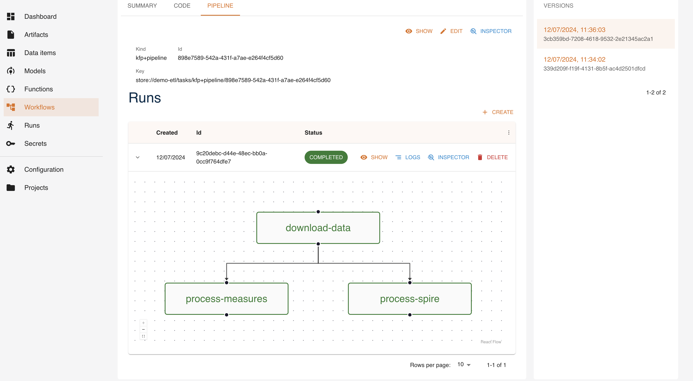

# Workflow

We define a simple workflow, which will execute all the ETL steps we have seen so far by putting their functions together:

``` python
%%writefile "src/pipeline.py"

from digitalhub_runtime_kfp.dsl import pipeline_context

def pipeline(url):
    with pipeline_context() as pc:
        downloader = pc.step(
            name="download-data",
            function="download-data",
            action="job",
            inputs={"url": url},
            outputs={"dataset": "dataset"},
        )

        process_spire = pc.step(
            name="process-spire",
            function="process-spire",
            action="job",
            inputs={"di": downloader.outputs["dataset"]}
        )

        process_measures = pc.step(
            name="process-measures",
            function="process-measures",
            action="job",
            inputs={"di": downloader.outputs["dataset"]}
        )
```

Here in the definition we use a simple DSL to represent the execution of our functions as steps of the workflow. The DSL ``step`` method generates a KFP step that internally makes the remote execution of the corresponding job. Note that the syntax for step is similar to that of function execution.

Register the workflow:

``` python
workflow = project.new_workflow(name="pipeline", kind="kfp", code_src="src/pipeline.py", handler="pipeline")
```

And run it, this time remotely, passing the URL key as a parameter:

``` python
workflow.run(parameters={"url": di.key})
```

It is possible to monitor the execution in the Core console:



The next section will describe how to expose this newly obtained dataset as a REST API.
