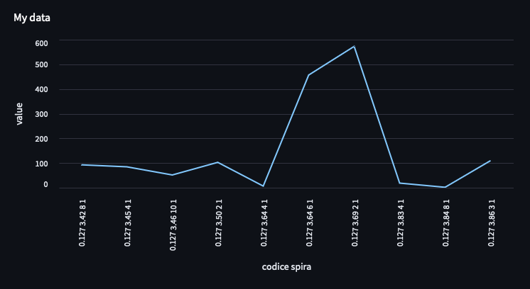

# Visualize data with Streamlit

We can take this one step further and visualize our data in a graph using [Streamlit](https://streamlit.io/), a library to create web apps and visualize data by writing simple scripts. Let's get familiar with it.

## Setup

From the Jupyter notebook you've been using, write the result of the API call to a file:

``` python
with open("result.json", "w") as file:
    file.write(res['data'])
```

Create the script that Streamlit will run:

``` python
%%writefile 'streamlit-app.py'

import pandas as pd
import streamlit as st

rdf = pd.read_json("result.json", orient="records")

# Replace colons in column names as they can cause issues with Streamlit
rdf.columns = rdf.columns.str.replace(":", "")

st.write("""My data""")
st.line_chart(rdf, x="codice spira", y="1200-1300")
```

## Launch app

In a new code cell, run the following to install Streamlit in the workspace. It's actually not code: the `!` at the beginning tells Jupyter to run the contents as a shell command.

```sh
!pip install streamlit
```

Similarly, run the following command. This will start hosting the Streamlit web app, so the cell will remain running. The `browser.gatherUsageStats` flag is set to `false` because, otherwise, Streamlit will automatically gather usage stats and print a warning about it.
```sh
!streamlit run streamlit-app.py --browser.gatherUsageStats false
```

Next, go to your Coder instance and access the Jupyter workspace you've been using.


Click on *Ports*, type `8501` (Streamlit's default port), then click the button next to it. It will open a tab to the Streamlit app, where you can visualize data!



The graph we displayed is very simple, but you are welcome to experiment with more Streamlit features. Don't forget to stop the above code cell, to stop the app.

!!! info "Connect to workspace remotely"

    Alternatively to running shell commands from Jupyter and port-forwarding through the Coder interface, you could connect your local shell to the workspace remotely. You do not need to do this if you already used the method above.

    Login to Coder with the following command. A tab will open in your browser, containing a token you must copy and paste to the shell (it may ask for your credentials, if your browser isn't already logged in).

    ``` shell
    coder login https://coder.my-digitalhub-instance.it
    ```

    With this, your shell is authenticated to the Coder instance, and the following command will be able to connect your shell to the workspace remotely, while tunneling port 8501:

    ``` shell
    ssh -L 8501:localhost:8501 coder.my-jupyter-workspace
    ```

    Install streamlit:

    ``` shell
    pip install streamlit
    ```

    Run the app:

    ``` shell
    streamlit run streamlit-app.py --browser.gatherUsageStats false
    ```

    Access `localhost:8501` on your browser to view the app!

## As Docker container

Streamlit apps can be run as Docker containers. For this section, we will run the same application locally as a container, so you will need either Docker or Podman installed on your machine. Instructions refer to Docker, but if you prefer to use Podman, commands are equivalent: simply replace instances of `docker` with `podman`.

Download the `result.json` file obtained previously on your machine, as we will need its data for the app. Also download the `streamlit-app.py` file.

Create a file named `Dockerfile` and paste the following contents in it:
``` Dockerfile
FROM python:3.9-slim

WORKDIR /app

RUN apt-get update && apt-get install -y \
    build-essential \
    curl \
    software-properties-common \
    git \
    && rm -rf /var/lib/apt/lists/*

COPY streamlit-app.py streamlit-app.py
COPY result.json result.json

RUN pip3 install altair pandas streamlit

EXPOSE 8501

HEALTHCHECK CMD curl --fail http://localhost:8501/_stcore/health

ENTRYPOINT ["streamlit", "run", "streamlit-app.py", "--browser.gatherUsageStats=false"]
```

The Dockerfile describes how the image for the container will be built. In short, it installs the required libraries, copies the files you downloaded, then launches the Streamlit script.

Make sure the three files are in the same directory, then open a shell in it and run the following, which builds the Docker image:
``` shell
docker build -t streamlit .
```

Once it's finished, you can verify the image exists with:
``` shell
docker images
```

Now, run a container:
``` shell
docker run -p 8501:8501 --name streamlit-app streamlit
```

!!! info "Port already in use"

    If you run into an error, it's likely that you didn't quit the remote session you opened while following the previous section, meaning port 8501 is already in use.

Open your browser and visit `localhost:8501` to view the data!

To stop the container, simply press *Ctrl+C*, then run the following to remove the container:
``` shell
docker rm -f streamlit-app
```