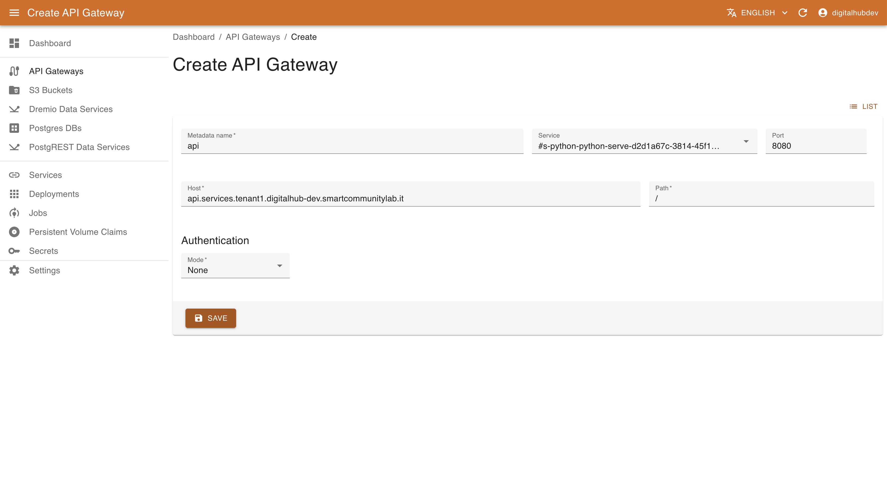

# Deploy and expose the model

Deploying a scikit-learn model is easy: ``sklearnserve`` runtime supports this functionality out of the box. It is sufficient to specify the path to the model artifact and optionally the name of the model to expose.

Register it and deploy:
``` python
func = project.new_function(name="serve_sklearnmodel",
                            kind="sklearnserve",
                            model_name="testmodel",
                            path=model.spec.path)

serve_run = func.run(action="serve")
```

You can now test the endpoint (using e.g., X_test):
``` python
import requests

SERVICE_URL = serve_run.refresh().status.to_dict()["service"]["url"]
MODEL_NAME = "testmodel"

test_input = X_test.head(2).to_numpy().tolist()

with requests.post(f'http://{SERVICE_URL}/v2/models/{MODEL_NAME}/infer', json={
    "inputs": [
        {
        "name": "input-0",
        "shape": [2, 30],
        "datatype": "FP32",
        "data": test_input
        }
    ]
}) as r:
    res = r.json()
print(res)
```

Please note that the scikit-learn model serving exposes also the Open API specification under ``/docs`` path.

## Create an API gateway

Right now, the API is only accessible from within the environment. To make it accessible from outside, we'll need to create an API gateway.

Go to the Kubernetes Resource Manager component (available from dashboard) and go to the API Gateways section. To expose a service it is necessary to define

- name of the gateway
- the service to expose
- the endpoint where to publish
- and the authentication method (right now only no authentication or basic authentication are available). in case of basic authentication it is necessary to specify  *Username* and *Password*.

The platform by default support exposing the methods at the subdomains of ``services.<platform-domain>``, where platform-domain is the domain of the platform instance. 



*Save* and, after a few moments, you will be able to call the API at the address you defined! If you set *Authentication* to *Basic*, don't forget that you have to provide the credentials.