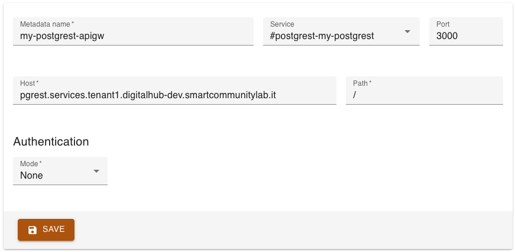

# Expose service externally

Finally, we make the PostgREST service available externally. Access *API Gateways* on the left menu and click `CREATE`.

Fill the fields as follows:

- **Name**: name of the gateway. This is merely an identifier for Kubernetes.
- **Service**: select the one referring to the PostgREST service you created. Its name may be something like `postgrest-my-postgrest`. **Port** will automatically be filled.
- **Host**: full domain name under which the service will be exposed. By default, it refers to the `services` subdomain. If your instance of the platform is found in the `example.com` domain, this field's value could be `pgrest.services.example.com`.
- **Path**: Leave the default `/`.
- **Authentication**: `None`.



Save and the API gateway will be created. You can try a simple query like the following, even in your browser, to view its results (remember to change domain according to your case):
```
https://pgrest.services.example.com/readings?limit=3
```
