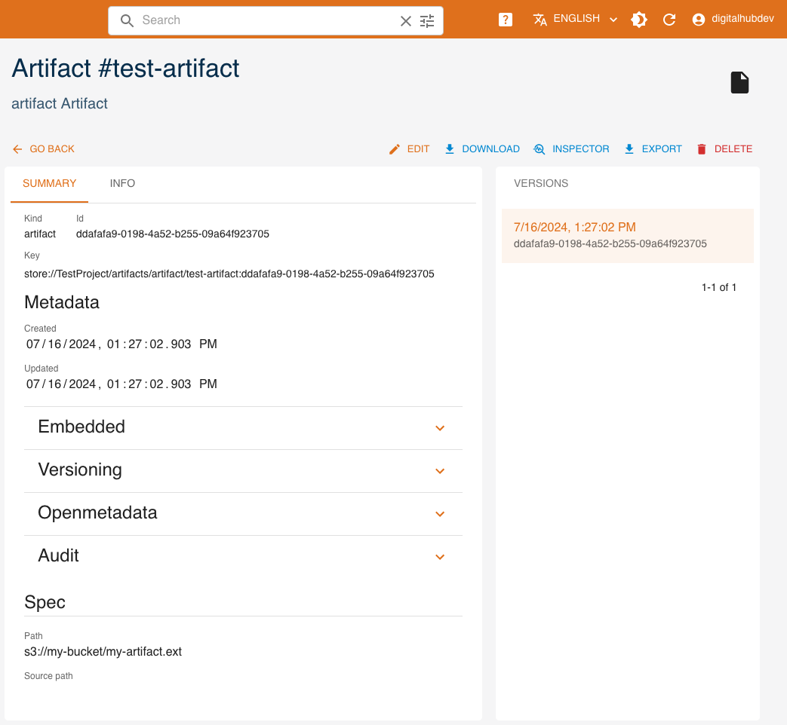
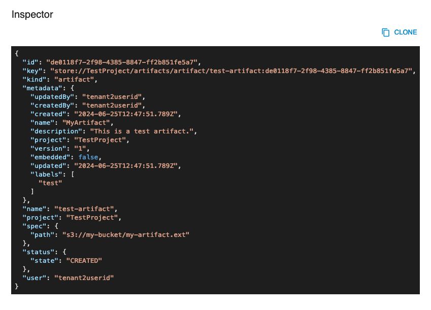
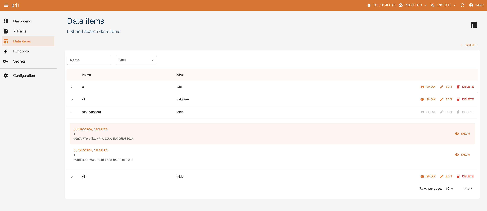

# Data and transformations

The platform supports data of different types to be stored and operated by the underlying storage subsystems.

Digital Hub natively supports two types of storages:

- *persistence* object storage (datalake S3 Minio), which manages immutable data in the form of files.
- *operational* relational data storage (PostgreSQL database), which is used for efficient querying of mutable data. *Postgres* is rich with extensions, most notably for geo-spatial and time-series data.

The data is represented in the platform as entities of different types, depending on its usage and format. More specifically, we distinguish:

- *data items*, which represent immutable data sets resulting from different transformation operations and are ready for use in differerent types of analysis. Data items are enriched with metadata (versions, lineage, stats, profiling, schema, ...) and unique keys and managed and persisted to the datalake directly by the platform in the form of *Parquet* files. It is possible to treat tabular data (items of ``table`` kind) as, for example, *DataFrames*, using conventional libraries.
- *artifacts*, which represent arbitrary files, not limited to tabular format, stored to the datalake with some extra metadata.

Each data entity may be accessed and manipulated by the platform via UI or using the API, for example with SDK.

## Manipulating data via UI

### Artifacts

Artifacts can be created and managed as *entities* with the console. You can access them from the dashboard or the left menu. You can:

- `create` a new artifact
- `expand` an artifact to see its 5 latest versions
- `show` the details of an artifact
- `edit` an artifact
- `delete` an artifact
- `filter` artifacts by name and kind


Here we analyze how to [create](#create), [read](#read), [update](#update) and [delete](#delete) Artifacts using the UI, similarly to what is done with the SDK.

#### Create

Click `CREATE` and a form will be shown:


Mandatory fields are:

- **`Name`**: name and identifier of the artifact
- **`Kind`**: kind of the artifact
- (Spec) **`Path`**: remote path where the artifact is stored

Other fields are optional and may be updated later.

- (Metadata) **`Name`**: name of the artifact
- (Metadata) **`Description`**: a human-readable description of the artifact
- (Metadata) **`Version`**: version of the artifact
- (Metadata) **`Labels`**: list of labels
- (Spec) **`Source path`**: local path to the artifact, used in case of upload into remote storage

#### Read

Click `SHOW` to view an artifact's details.



On the right side, all versions of the resource are listed, with the current one highlighted. By clicking a different version, values displayed will change accordingly.

The `INSPECTOR` button will show a dialog containing the resource in JSON format.



The `EXPORT` button will download the resource's information as a yaml file.

#### Update

You can update an artifact by clicking `EDIT`. Greyed-out fields may not be updated.

#### Delete

You can delete an artifact from either its detail page or the list of artifacts, by clicking `DELETE`.

### Data items

Data items can be created and managed as *entities* with the console. You can access them from the dashboard or the left menu. You can:

- `create` a new data item
- `expand` a data item and see its 5 latest versions
- `show` the details of a data item
- `edit` a data item
- `delete` a data item
- `filter` data items by name and kind



Here we analyze how to [create](#create_1), [read](#read_1), [update](#update_1) and [delete](#delete_1) data items using the UI, similarly to what is done with the SDK.

#### Create

Click `CREATE` and a form will be shown:


Mandatory fields are:

- **`Name`**: name of the dataitem
- **`Kind`**: kind of the dataitem
- (Spec) **`Path`**: remote path where the data item is stored

Other fields are optional and may be updated later:

- (Metadata) **`Name`**: name of the data item
- (Metadata) **`Description`**: a human-readable description
- (Metadata) **`Version`**: version of the data item
- (Metadata) **`Updated`**: date of last modification
- (Metadata) **`Labels`**: list of labels
- (Spec) **`Source path`**: local path of the data item, used in case of upload into remote storage

##### Kind

There are 2 possible kinds for dataitems:

- **`Dataitem`**: indicates it is a generic data item. There are no specific attributes in the creation page.
- **`table`**: indicates that the data item points to a table. The optional parameter is the schema of the table in [table_schema](https://specs.frictionlessdata.io/table-schema/) format.

#### Read

Click `SHOW` to view a data item's details.


Based on the `kind`, there may be a **`schema`**, indicating that the dataitem point to a table.

On the right side, all versions of the resource are listed, with the current one highlighted. By clicking a different version, values displayed will change accordingly.

The `INSPECTOR` button will show a dialog containing the resource in JSON format.


The `EXPORT` button will download the resource's information as a yaml file.

#### Update

You can update a data item by clicking `EDIT`. Greyed-out fields may not be updated.

#### Delete

You can delete a data item from either its detail page or the list of data items, by clicking `DELETE`.

## Managing data with SDK

### Artifacts

Artifacts (ARTIFACT) are (binary) objects stored in one of the artifact stores of the platform, and available to every process, module and component as files (or data streams).
Artifacts can be created and managed as *entities* with the SDK CRUD methods. This can be done directly from the package or through the `Project` object.
To manage artifacts, you need to have the `digitalhub_core` layer installed.

In the first section, we will see how to create, read, update and delete artifacts.
In the second section, we will see what can be done with the `Artifact` object.

#### Artifact Management via SDK

An `artifact` can be managed with the following methods.

- [**`new_artifact`**](#create_2): create a new artifact
- [**`get_artifact`**](#read_2): get an artifact
- [**`update_artifact`**](#update_2): update an artifact
- [**`delete_artifact`**](#delete_2): delete an artifact
- [**`list_artifacts`**](#list): list all artifacts

This is done in two ways. The first is through the SDK and the second is through the `Artifact` object.
Example:

```python
import digitalhub as dh

project = dh.get_or_create_project("my-project")

## From library
artifact = dh.new_artifact(project="my-project",
                           name="my-artifact",
                           kind="artifact",
                           path="s3://my-bucket/my-artifact.ext")

## From project
artifact = project.new_artifact(name="my-artifact",
                                kind="artifact",
                                path="s3://my-bucket/my-artifact.ext")
```

The syntax is the same for all CRUD methods. The following sections describe how to create, read, update and delete an artifact, focusing on managing artifacts through the library. If you want to manage artifacts from the project, you can use the `Project` object and avoid having to specify the `project` parameter.

##### Create

To create an artifact you can use the `new_artifact()` method.

Mandatory parameters are:

- **`project`**: the project in which the artifact will be created
- **`name`**: the name of the artifact
- **`kind`**: the kind of the artifact
- **`path`**: the remote path where the artifact is stored

Optional parameters are:

- **`uuid`**: the uuid of the artifact (this is automatically generated if not provided). **Must** be a valid uuid v4.
- **`description`**: the description of the artifact
- **`source`**: the remote source of the artifact (git repository)
- **`labels`**: the labels of the artifact
- **`embedded`**: whether the artifact is embedded or not. If `True`, the artifact is embedded (all the spec details are expressed) in the project. If `False`, the artifact is not embedded in the project
- **`src_path`**: local path of the artifact, used in case of upload into remote storage
- **`kwargs`**: keyword arguments passed to the *spec* constructor

Example:

```python
artifact = dh.new_artifact(project="my-project",
                           name="my-artifact",
                           kind="artifact",
                           path="s3://my-bucket/my-artifact.ext")
```

##### Read

To read an artifact you can use the `get_artifact()` or `import_artifact()` methods. The first one searches for the artifact into the backend, the second one loads it from a local yaml.

###### Get

Mandatory parameters are:

- **`project`**: the project in which the artifact will be created

Optional parameters are:

- **`entity_name`**: to use the name of the artifact as identifier. It returns the latest version of the artifact
- **`entity_id`**: to use the uuid of the artifact as identifier. It returns the specified version of the artifact
- **`kwargs`**: keyword arguments passed to the client that communicates with the backend

Example:

```python
artifact = dh.get_artifact(project="my-project",
                           entity_name="my-artifact")

artifact = dh.get_artifact(project="my-project",
                           entity_id="uuid-of-my-artifact")
```

###### Import

Mandatory parameters are:

- **`file`**: file path to the artifact yaml

Example:

```python
artifact = dh.import_artifact(file="./some-path/my-artifact.yaml")
```

##### Update

To update an artifact you can use the `update_artifact()` method.

Mandatory parameters are:

- **`artifact`**: artifact object to be updated

Optional parameters are:

- **`kwargs`**: keyword arguments passed to the client that communicates with the backend

Example:

```python
artifact = dh.new_artifact(project="my-project",
                           name="my-artifact",
                           kind="artifact",
                           path="s3://my-bucket/my-artifact.ext")

artifact.metadata.description = "My new description"

artifact = dh.update_artifact(artifact=artifact)
```

##### Delete

To delete an artifact you can use the `delete_artifact()` method.

Mandatory parameters are:

- **`project`**: the project in which the artifact exists

Optional parameters are:

- **`entity_name`**: to use the name of the artifact as identifier
- **`entity_id`**: to use the uuid of the artifact as identifier
- **`delete_all_versions`**: if `True`, all versions of the artifact will be deleted. Mutually exclusive with the `entity_id` parameter.
- **`kwargs`**: keyword arguments passed to the client that communicates with the backend

Example:

```python
artifact = dh.new_artifact(project="my-project",
                           name="my-artifact",
                           kind="artifact",
                           path="s3://my-bucket/my-artifact.ext")

dh.delete_artifact(project="my-project",
                   entity_id=artifact.id)
```

##### List

To list all artifacts you can use the `list_artifacts()` method.

Mandatory parameters are:

- **`project`**: the project containing the artifacts

Optional parameters are:

- **`kwargs`**: keyword arguments passed to the client that communicates with the backend

Example:

```python
artifacts = dh.list_artifacts(project="my-project")
```

#### Artifact object

The `Artifact` object is built using the `new_artifact()` method. There are several variations of the `Artifact` object based on the `kind` of the artifact. The SDK supports the following kinds:

- **`artifact`**: represents a generic artifact

For each different kind, the `Artifact` object has a different set of methods and different `spec`, `status` and `metadata`.
All the `Artifact` kinds have a `save()` and an `export()` method to save and export the *entity* artifact into backend or locally as yaml.

To create a specific artifact, you must use the desired `kind` in the `new_artifact()` method.

##### Artifact

The `artifact` kind indicates that the artifact is a generic artifact.
There are no specific `spec` parameters.

The `artifact` kind has the following methods:

- **`as_file()`**: collects the artifact into a local temporary file
- **`download()`**: downloads the artifact into a specified path
- **`upload()`**: uploads the artifact to a specified path

###### As file

The `as_file()` method returns the artifact as a temporary file. The file **is not** automatically deleted when the program ends.
The method returns the path of the downloaded artifact.

###### Download

The `download()` method downloads the artifact into a specified path.
The method returns the path of the downloaded artifact.
The method accepts the following parameters:

- **`target`**: remote path of the artifact to be downloaded (eg. `s3://my-bucket/my-artifact.ext`). By default, uses the `spec` `path`.
- **`dst`**: local path where the artifact will be downloaded. By default, it is in the current working directory
- **`overwrite`**: if `True`, the target path will be overwritten if it already exists

###### Upload

The `upload()` method uploads the artifact to a specified path.
The method returns the path of the uploaded artifact.
The method accepts the following parameters:

- **`source`**: local path of the artifact to be uploaded
- **`target`**: remote path of the artifact to be uploaded (eg. `s3://my-bucket/my-artifact.ext`). By default, uses the `spec` `path`.


### Data items

Data items (DATAITEM) are data objects which contain a dataset of a given type, stored in an addressable repository and accessible to every component able to understand the type (kind) and the source (path). Do note that data items could be stored in the artifact store as artifacts, but that is not a dependency or a requirement.
Dataitems can be created and managed as *entities* with the SDK CRUD methods. This can be done directly from the package or through the `Project` object.
To manage dataitems, you need to have the `digitalhub_data` layer installed.

In the first section, we will see how to create, read, update and delete dataitems.
In the second section, we will see what can be done with the `Dataitem` object.

#### Data item management via SDK

A `data item` can be managed with the following methods.

- [**`new_dataitem`**](#create_3): create a new data item
- [**`get_dataitem`**](#read_3): get a data item
- [**`update_dataitem`**](#update_3): update a data item
- [**`delete_dataitem`**](#delete_3): delete a data item
- [**`list_dataitems`**](#list_1): list all data items

This is done in two ways. The first is through the SDK and the second is through the `Dataitem` object.
Example:

```python
import digitalhub as dh

project = dh.get_or_create_project("my-project")

## From library
dataitem = dh.new_dataitem(project="my-project",
                           name="my-dataitem",
                           kind="dataitem",
                           path="s3://my-bucket/my-dataitem.ext")

## From project
dataitem = project.new_dataitem(name="my-dataitem",
                                kind="dataitem",
                                path="s3://my-bucket/my-dataitem.ext")
```

The syntax is the same for all CRUD methods. The following sections describe how to create, read, update and delete a data item, focusing on managing data items through the library. If you want to manage data items from the project, you can use the `Project` object and avoid having to specify the `project` parameter.

##### Create

To create a data item you can use the `new_dataitem()` method.

Mandatory parameters are:

- **`project`**: project in which the data item will be created
- **`name`**: name of the data item
- **`kind`**: kind of the data item
- **`path`**: remote path where the data item is stored

Optional parameters are:

- **`uuid`**: uuid of the data item (this is automatically generated if not provided). **Must** be a valid uuid v4.
- **`description`**: description of the data item
- **`source`**: remote source of the data item (git repository)
- **`labels`**: list of labels
- **`embedded`**: whether the data item is embedded or not. If `True`, the data item is embedded (all the spec details are expressed) in the project. If `False`, the data item is not embedded in the project.
- **`kwargs`**: keyword arguments passed to the *spec* constructor

Example:

```python
dataitem = dh.new_dataitem(project="my-project",
                           name="my-dataitem",
                           kind="dataitem",
                           path="s3://my-bucket/my-dataitem.ext")
```

##### Read

To read a data item you can use the `get_dataitem()` or `import_dataitem()` methods. The first one searches for the data item into the backend, the second one load it from a local yaml.

###### Get

Mandatory parameters are:

- **`project`**: the project in which the data item will be created

Optional parameters are:

- **`entity_name`**: to use the name of the data item as identifier. It returns the latest version of the data item.
- **`entity_id`**: to use the uuid of the data item as identifier. It returns the specified version of the data item.
- **`kwargs`**: keyword arguments passed to the client that communicates with the backend

Example:

```python
dataitem = dh.get_dataitem(project="my-project",
                           entity_name="my-dataitem")

dataitem = dh.get_dataitem(project="my-project",
                           entity_id="uuid-of-my-dataitem")
```

###### Import

Mandatory parameters are:

- **`file`**: file path to the dataitem yaml

Example:

```python
dataitem = dh.import_dataitem(file="./some-path/my-dataitem.yaml")
```

##### Update

To update a data item you can use the `update_dataitem()` method.

Mandatory parameters are:

- **`dataitem`**: data item object to be updated

Optional parameters are:

- **`kwargs`**: keyword arguments passed to the client that communicates with the backend

Example:

```python
dataitem = dh.new_dataitem(project="my-project",
                           name="my-dataitem",
                           kind="dataitem",
                           path="s3://my-bucket/my-dataitem.ext")

dataitem.metadata.description = "My new description"

dataitem = dh.update_dataitem(dataitem=dataitem)
```

##### Delete

To delete a data item you can use the `delete_dataitem()` method.

Mandatory parameters are:

- **`project`**: the project in which the data item exists

Optional parameters are:

- **`entity_name`**: to use the name of the data item as identifier
- **`entity_id`**: to use the uuid of the data item as identifier
- **`delete_all_versions`**: if `True`, all versions of the data item will be deleted. Its mutually exclusive with the `entity_id` parameter
- **`kwargs`**: keyword arguments passed to the client that communicates with the backend

Example:

```python
dataitem = dh.new_dataitem(project="my-project",
                           name="my-dataitem",
                           kind="dataitem",
                           path="s3://my-bucket/my-dataitem.ext")

dh.delete_dataitem(project="my-project",
                   entity_id=dataitem.id)
```

##### List

To list all data items you can use the `list_dataitems()` method.

Mandatory parameters are:

- **`project`**: the project containing the data items

Optional parameters are:

- **`kwargs`**: keyword arguments passed to the client that communicates with the backend

Example:

```python
dataitems = dh.list_dataitems(project="my-project")
```

#### Dataitem object

The `Dataitem` object is built using the `new_dataitem()` method. There are several variations of the `Dataitem` object based on the `kind` of the data item. The SDK supports the following kinds:

- **`dataitem`**: represents a generic data item
- **`table`**: represents a table data item

For each different kind, the `Dataitem` object has a different set of methods and different `spec`, `status` and `metadata`.

To create a specific data item, you must use the desired `kind` in the `new_dataitem()` method.
All the `Dataitem` kinds have a `save()` and an `export()` method to save and export the *entity* data item into backend or locally as yaml.

##### Dataitem

The `dataitem` kind indicates that the data item is a generic data item.
There are no specific `spec` parameters nor specific method exposed. It acts as a generic data item.

##### Table

The `table` kind indicates that the data item point to a table.
The optional `spec` parameters are:

- **`schema`**: the schema of the table in [table_schema](https://specs.frictionlessdata.io/table-schema/) format

The `table` kind also has the following methods:

- **`as_df()`**: to collect the data in a pandas dataframe
- **`write_df()`**: to write the data item as parquet

###### Read table

The `as_df()` method returns the data in a pandas dataframe.
The method accepts the following parameters:

- **`format`**: the format of the data. If not provided, the format will be inferred from the file extension. We support **ONLY** parquet or csv.
- **`kwargs`**: keyword arguments passed to the pandas `read_parquet` or `read_csv` method

###### Write table

The `write_df()` method writes the data item as parquet.
The method accepts the following parameters:

- **`target_path`**: the path of the target parquet file. If not provided, the target path will created by the SDK and the data item will be stored in the default store
- **`kwargs`**: keyword arguments passed to the pandas `to_parquet` method
