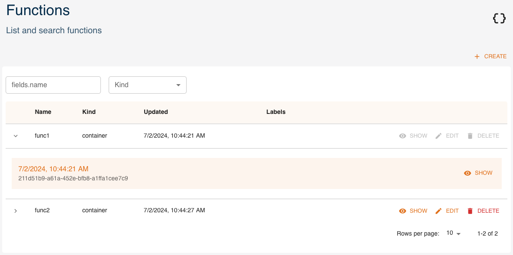
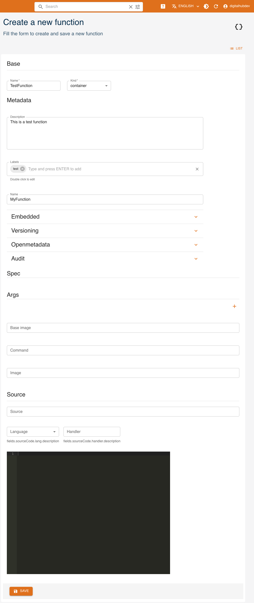
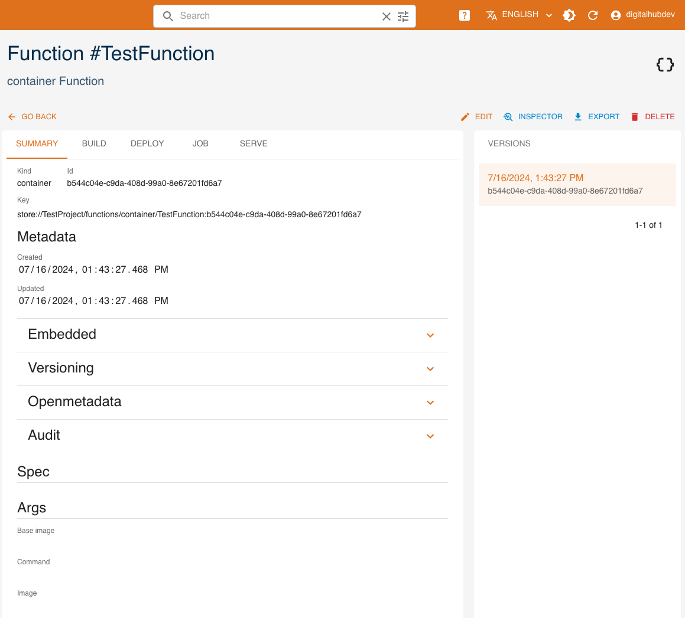
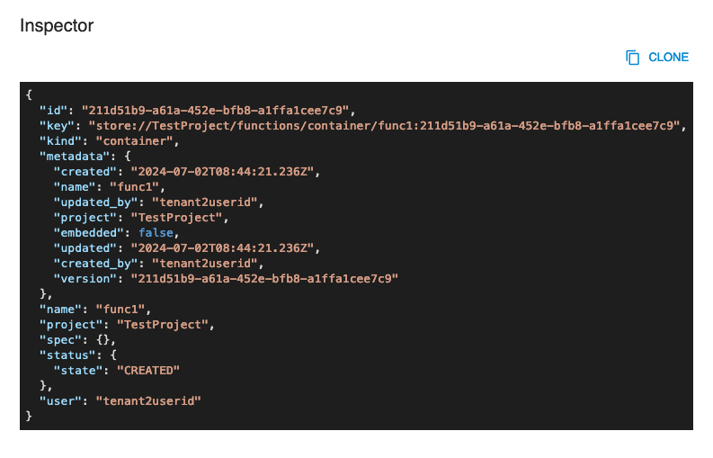
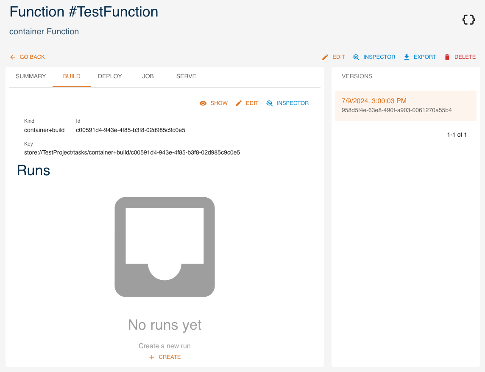
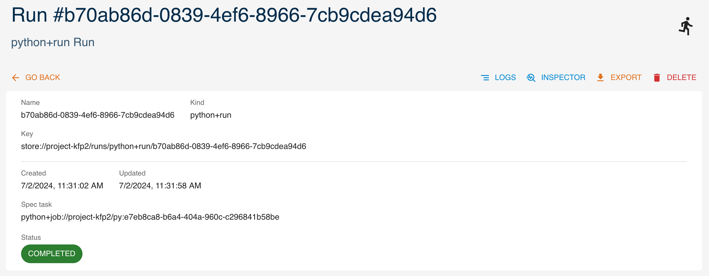
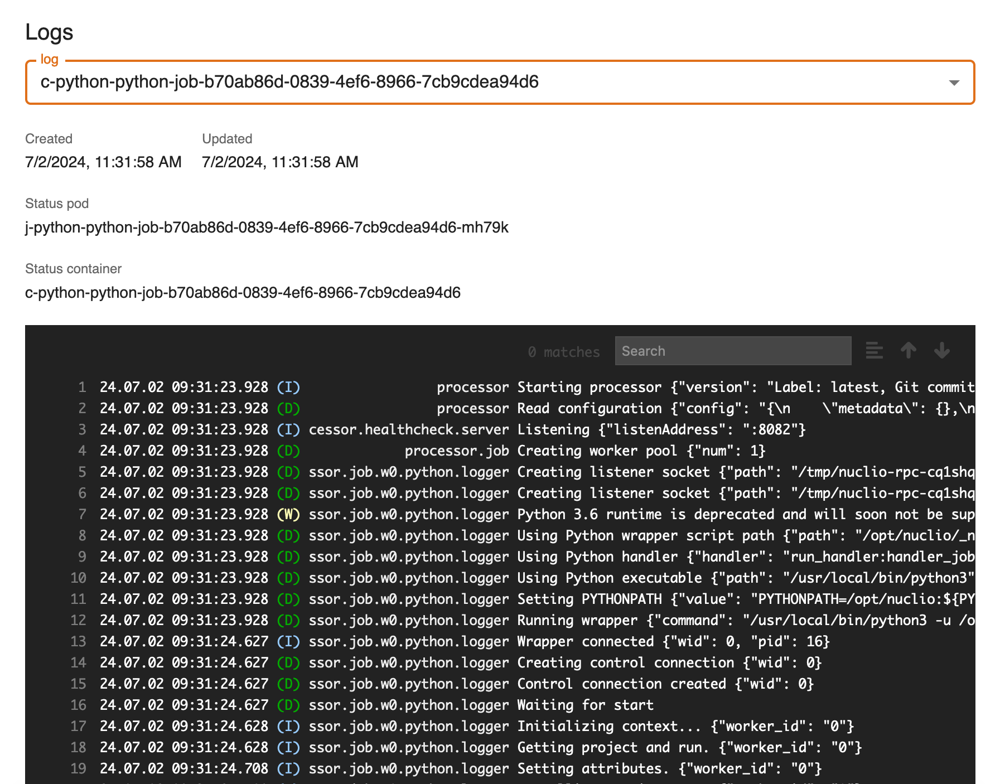

# Functions and Runtimes

**Functions** are the logical description of something that the platform may execute and track for you. A function may represent code to run as a job, an ML model inference to be used as batch procedure or as a service, a data validation, etc.

In the platform we perform **actions** over functions (also referred to as "tasks"), such as job execution, deploy, container image build. A single action execution is called **run**, and the platform keeps track of these runs, with metadata about function version, operation parameters, and runtime parameters for a single execution. 

They are associated with a given **runtime**, which implements the actual execution and determines which actions are available. Examples are DBT, Nefertem, Python, etc. Runtimes  are highly specialized components which can translate the representation of a given execution, as expressed in the run, into an actual execution operation performed via libraries, code, external tools etc.

Runtimes define the key point of extension of the platform: new runtimes may be added in order to implement the low-level logic of "translating" the high level operation definition into an executable run. For example, DBT runtime allows for defining the transformation as a task that, given the input table reference, 
produces a datastt appyling the function defined as SQL code. The runtime in this case is responsible for converting the specification and the references to a dedicated Kubernetes Job that runs DBT transformation and stores the corresponding dataset.

The set of the supported runtimes is documented in Runtimes References section. Independently of the specific runtime implementation, the flow of actions 
with respect to the function definition and execution is the following:

- define a new function providing its name, runtime, definition (e.g., source code), and configuration (e.g., dependencies). The function definition is saved by the project. Each change to the function spec creates a new function version so that the executions of different function versions are independently tracked.
- execute a task over the function providing the configuration of the task (e.g., the K8S resources needed for the execution), the execution parameters and inputs (if any). This creates a new task specification and a new run instance tracked by the platform. 

The definition and execution of the functions may be performed either via UI or via Python SDK.

## Management via UI

### Functions

Functions can be created and managed as *entities* from the console. You can access them from the dashboard or the left menu. You can:

- `create` a new function
- `expand` a function to see its 5 latest versions
- `show` the details of a function
- `edit` a function
- `delete` a function
- `filter` functions by name and kind



Here we analyze how to [create](#create), [read](#read), [update](#update) and [delete](#delete) functions using the UI, similarly to what can be done through the SDK.

#### Create

Click `CREATE` and a form will be shown:



Mandatory fields are:

- **`Name`**: name and identifier of the function
- **`Kind`**: kind of function

Metadata fields are optional and may be updated later.

- **`Description`**: a human-readable description
- **`Labels`**: list of labels
- **`Name`**: name of the function
- **`Embedded`**: flag for embedded metadata
- **`Versioning`**: version of the function
- **`Openmetadata`**: flag to publish metadata
- **`Audit`**: author of creation and modification

`Spec` fields will change depending on the function's kind.

#### Read

Click `SHOW` to view a function's details.



Tabs next to `SUMMARY` will change depending on the function's `kind`. Some of them allow you to create runs, but we will see this in a [later section](#runs).

On the right side, all versions of the resource are listed, with the current one highlighted. By clicking a different version, values displayed will change accordingly.

The `INSPECTOR` button will show a dialog containing the resource in JSON format.



The `EXPORT` button will download the resource's information as a yaml file.

#### Update

You can update a function by clicking `EDIT`. Greyed-out fields may not be updated.

#### Delete

You can delete a function from either its detail page or the list of functions, by clicking `DELETE`.

### Runs

#### Create

A run represents the execution of a task through a function. As such, the starting point to create a run is the function it is based on. Select one of the functions you created. You will notice multiple tabs at the top, next to `SUMMARY`. These tabs may differ depending on the function's `kind`.



Click `CREATE` to create a new run. You will start a 3-steps process to create a run.

The **first** step will ask for parameters that depend on the function's `kind` and the task you are creating the run for, but will generally also ask if you wish to configure resources to allocate, environment variables, secrets, volumes and node modules.

The **second** step will ask, if applicable, to specify inputs, outputs and parameters.

The **third** step will simply present a recap.


#### View and manage

By going through a function's tabs, you can access the corresponding runs, but you may also access all runs from the *Runs* section in the left menu (also available as *Jobs and runs* in the dashboard).

You can filter runs by name, kind and status.


Click on a run to view its details.



From here, click on `LOGS` to view its logs.



## Management via SDK

In the following sections, we will see how to create, read, update and delete functions and what can be done with the [`Function` object](#function-object) through the SDK, including how to [create `Run` objects](#run).

You can manage the `Function` entity with the following methods:

- **`new_function`**: create a new function
- **`get_function`**: get a function
- **`update_function`**: update a function
- **`delete_function`**: delete a function
- **`list_functions`**: list all functions

This can be done through the SDK, or through the `Project` object.

Example:

```python
import digitalhub as dh

project = dh.get_or_create_project("my-project")

## From library
function = dh.new_function(project="my-project",
    name="my-function",
    kind="function-kind",
    **kwargs)

## From project
function = project.new_function(name="my-function",
    kind="function-kind",
    **kwargs)
```

### Create

To create a function you can use the `new_function()` method.

Mandatory parameters are:

- **`project`**: the project in which the function will be created
- **`name`**: name of the function
- **`kind`**: kind of the function

Optional parameters are:

- **`uuid`**: the uuid of the function (this is automatically generated if not provided). If provided, **must** be a valid uuid v4.
- **`description`**: description of the function
- **`labels`**: labels for the function
- **`git_source`**: remote source of the function
- **`kwargs`**: keyword arguments passed to the *spec* constructor

Example:

```python
function = dh.new_function(project="my-project",
                           name="my-function",
                           kind="function-kind",
                           **kwargs)
```

### Read

To read a function you can use the `get_function()` or `import_function()` methods. The first one searches for the function in the back-end, the second one loads it from a local yaml file.

#### Get

Mandatory parameters are:

- **`project`**: the project in which the function will be created

Optional parameters are:

- **`entity_name`**: to use the name of the function as identifier. It returns the latest version of the function.
- **`entity_id`**: to use the uuid of the function as identifier. It returns the specified version of the function.
- **`kwargs`**: keyword arguments passed to the client that communicates with the back-end

Examples:

```python
function = dh.get_function(project="my-project",
                           entity_name="my-function")

function = dh.get_function(project="my-project",
                           entity_id="uuid-of-my-function")
```

#### Import

Mandatory parameters are:

- **`file`**: file path to the function yaml

Example:

```python
function = dh.import_function(file="my-function.yaml")
```

### Update

To update a function, use the `update_function()` method.

Mandatory parameters are:

- **`function`**: the function object to update

Optional parameters are:

- **`kwargs`**: keyword arguments passed to the client that communicates with the back-end

Example:

```python
function = dh.update_function(function=function,
                              **kwargs)
```

### Delete

To delete a function, use the `delete_function()` method.

Mandatory parameters are:

- **`project`**: the project in which the function will be created

Optional parameters are:

- **`entity_name`**: to use the name of the function as identifier
- **`entity_id`**: to use the uuid of the function as identifier. Mutually exclusive with `delete_all_versions`.
- **`delete_all_versions`**: if `True`, all versions of the function will be deleted. Mutually exclusive with `entity_id`.
- **`cascade`**: if `True`, all `Task` and `Run` objects associated with the function will be deleted
- **`kwargs`**: keyword arguments passed to the client that communicates with the back-end

Example:

```python
function = dh.delete_function(project="my-project",
                              entity_name="my-function")
```

### List

To list all functions, use the `list_functions()` method.

Mandatory parameters are:

- **`project`**: the project in which the function will be created

Optional parameters are:

- **`kwargs`**: keyword arguments passed to the client that communicates with the back-end

Example:

```python
functions = dh.list_functions(project="my-project")
```

### Function object

The `Function` object represents an executable function. The object exposes methods for saving and exporting the *entity* function into backend or locally as yaml and to execute it.

#### Save

To save a function in the back-end, use the `save()` method.

The method accepts the following optional parameters:

- **`update`**: a boolean value, if `True` the function will be updated on the back-end

Example:

```python
function.save()
```

#### Export

To export a function as yaml, use the `export()` method.

The method accepts the following optional parameters:

- **`filename`**: the name of the file to export

Example:

```python
function.export(filename="my-function.yaml")
```

#### Run

To run a function, use the `run()` method. This method is a shortcut for:

- creating a `Task` object
- creating a `Run` object
- executing the `Run` object

The method accepts the following mandatory parameters:

- **`action`**: the action to be executed. Possible values for this parameter depend on the `kind` of the function. See the runtimes section for more information.

The optional *task* parameters are as follows. For Kubernetes:

- **`node_selector`**: a list of node selectors. The runtime will select the nodes to which the task will be scheduled.
- **`volumes`**: a list of volumes
- **`resources`**: a map of resources (CPU, memory, GPU)
- **`affinity`**: node affinity
- **`tolerations`**: tolerations
- **`env`**: environment variables to inject into the container
- **`secrets`**: list of secrets to inject into the container
- **`backoff_limit`**: number of retries when a job fails.
- **`schedule`**: schedule of the job as a cron expression
- **`replicas`**: number of replicas of the deployment

For runtime-specific task parameters, see the runtime documentation.

The optional *run* parameters are:

- **`inputs`**: a map of inputs
- **`outputs`**: a map of outputs
- **`parameters`**: a map of parameters
- **`values`**: a list of values
- **`local_execution`**: if `True`, the function will be executed locally

Example:

```python
run = function.run(
    action="job",
    inputs={"input-param": "input-value"},
    outputs={"output-param": "output-value"}
)
```
