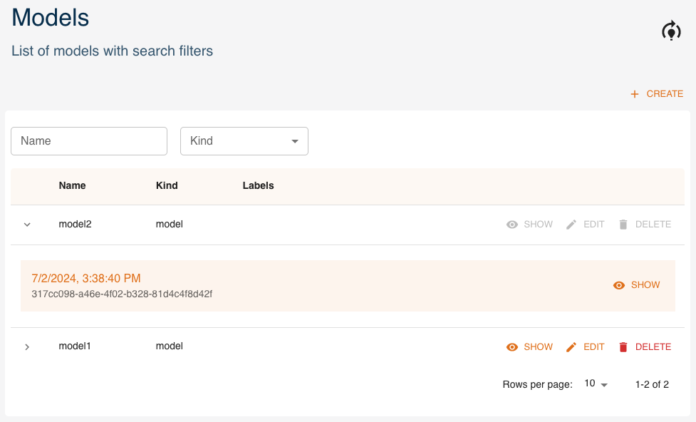
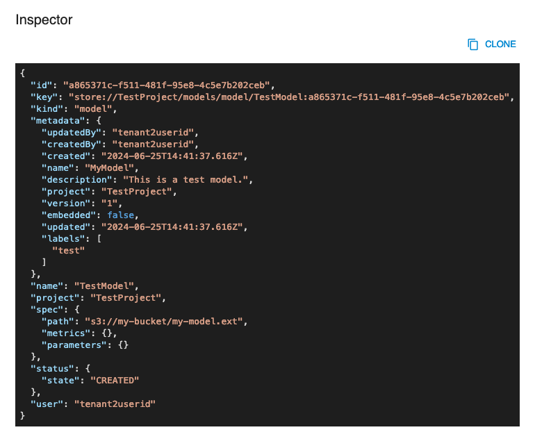

# ML Models

Support for MLOps is one of the key functionality of the platform. Creation, management, and serving ML models is supported by the platform via ML Model entities and the corresponding functionality for their registration and serving.

ML Model entity represent the relevant information about the model - framework and algorithms used to create it, hyper parameters and metrics, necessary artifacts constituting the model, etc. The platform support a list of standard model kinds as well as generic models. Specifically, it is possible to define models of the following kinds

- ``sklearn`` - ML models created with Scikit-learn framework and packaged as a single artifact.
- ``mlflow`` - ML models created with any MLFlow-compatible framework (or ``flavor`` in MLFlow terminology) and logged following the [MLFlow](https://mlflow.org/) model format.
- ``huggingface`` - LLM created using the [HuggingFace](https://huggingface.co/) framework and format, either standard one or fine-tuned.
- ``model`` - generic ML Model with custom packaging and framework.

For the specific ML Model formats the platform provides the support for serving those models as inference API in line with the [V2 open inference protocol](https://github.com/kserve/open-inference-protocol). These is achieved with the corresponding model serving runtimes.

## Management via UI

Models can be created and managed as *entities* with the console. You can access them from the dashboard or the left menu. You can:

- `create` a new model
- `expand` a model to see its 5 latest versions
- `show` the details of a model
- `edit` a model
- `delete` a model
- `filter` models by name and kind

We will now see how to [create](#create), [read](#read), [update](#update) and [delete](#delete) models using the UI, similarly to what is done with the SDK.

### Create

Click `CREATE` and a form will be shown:

Mandatory fields are:

- **`Name`**: name and identifier of the model
- **`Kind`**: kind of the model
- (Spec) **`Path`**: remote path where the model is stored. If you instead upload the model at the bottom of the form, this will be the path to where it will be stored.

### Read

Click `SHOW` to view a model's details.

On the right side, all versions of the resource are listed, with the current one highlighted. By clicking a different version, values displayed will change accordingly.

The `INSPECTOR` button will show a dialog containing the resource in JSON format.

The `EXPORT` button will download the resource's information as a yaml file.

### Update

You can update a model by clicking `EDIT`. Greyed-out fields may not be updated.

### Delete

You can delete a model from either its detail page or the list of models, by clicking `DELETE`.

## Management via SDK

Models can be created and managed as *entities* with the SDK CRUD methods.
Check the [SDK Model documentation](https://scc-digitalhub.github.io/sdk-docs/objects/model/entity/) for more information.
