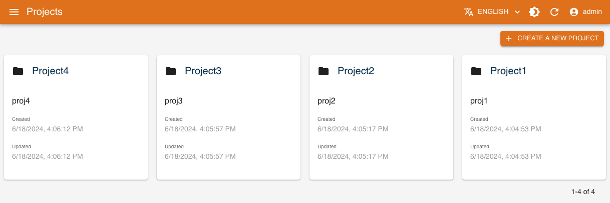
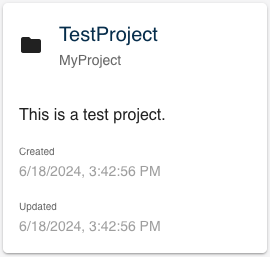

# Projects

A *project* represents a data and AI application and is a container for different entities (code, assets, configuration, ...) that form the application. It is the context in which you can run functions and manage models, data, and artifacts.
Projects may be created and managed from the UI, but also by using DH Core's API, for example via Python SDK.

## Management via UI

In the following sections we document project management via the `Core Console` UI.

Here we detail how to [create](#create), [read](#read), [update](#update) and [delete](#delete) projects using the UI, similarly to SDK usage.

### Create

A project is created by clicking `CREATE A NEW PROJECT` in the console's home page.

A form asking for the project's details is then shown:

The following parameters are mandatory:

- **`name`**: name of the project, also acts as identifier of the project

`Metadata` parameters are optional and may be changed later:

- **`name`**: name of the project
- **`description`**: a human-readable description of the project
- **`labels`**: list of labels

`Save` and the project will appear in the home page.

### Read

All projects present in the database are listed in the home page. Each tile shows:

- Identifier of the project
- Name of the project (hidden if same as identifier)
- Description
- Date of creation
- Date of last modification

Click on the tile to access the project's dashboard:

This dashboard shows a summary of the resources associated with the project and allows you to access the management of these resources.

- **`Jobs and runs`**: list and status of performed runs
- **`Models`**: number and list of latest models
- **`Functions and code`**: number and list of latest functions
- **`Data items`**: number and list of latest data items
- **`Artifacts`**: number and list of latest artifacts

You can return to the list of projects at any time by clicking *Projects* at the bottom of the left menu, or switch directly to a specific project by using the drop-down menu in the upper left of the interface.

### Update

To update a project's `Metadata`, first click `Configuration` in the left menu.

Click `Edit` in the top right and the edit form for `Metadata` properties will be shown. In the example below, a label was added.

When you're done updating the project, click *Save*.

### Delete

You can delete a project from the `Configuration` page, by clicking `Delete`. You will be asked to confirm by entering the project's identifier.

## Management via SDK

Projects can be created and managed as *entities* with the SDK.
Check the [SDK Project documentation](https://scc-digitalhub.github.io/sdk-docs/objects/project/entity/) for more information.
